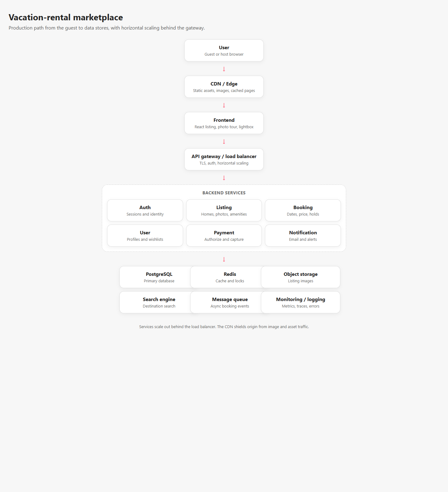

# Production architecture

This document describes a production-scale architecture for a vacation-rental marketplace. The submitted application is a desktop listing experience with a small Node API. The diagram shows how that experience would sit inside a larger system.

## Request path

1. A guest's browser talks to the CDN and edge network. Static assets, images, and cacheable listing pages are served from the edge.
2. The React frontend renders the listing, photo tour, and lightbox. Dynamic calls go to the API.
3. An API gateway and load balancer terminate TLS, authenticate requests, and spread traffic across stateless backend instances.
4. Domain services own their data and can scale horizontally:
   - **Auth** issues sessions and verifies guests and hosts.
   - **Listing** serves property content, amenities, photos, and house rules.
   - **Booking** holds dates, calculates price, and creates reservations.
   - **User** stores profiles, host stats, and saved homes.
   - **Payment** authorizes and captures charges without the listing page ever handling card data.
   - **Notification** sends booking and message alerts.
5. Shared infrastructure sits behind those services:
   - PostgreSQL is the primary system of record.
   - Redis caches hot listings, search facets, and short-lived reservation locks.
   - Object storage holds original and resized photos, delivered back through the CDN.
   - A search engine powers destination and availability search.
   - A message queue decouples booking events from email, push, and analytics.
   - Monitoring and logging cover latency, errors, and business events.

## How the assignment maps to this

The local Node server is a stand-in for the listing, booking, and report endpoints. The Vite app is the frontend. Images are loaded from Pexels, which stands in for object storage plus a CDN. A production deployment would put the built frontend on the edge and run several copies of the API behind the load balancer.
